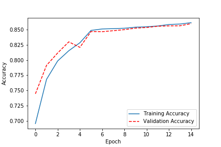

## Bitcoin-predictions

### Summary

The puropse of this project is to make predictions on whether the price of Bitcoin will increase or decrease. The Keras framework was used to implement a LSTM (Long-Short Term Memory) model. The dataset is a series of 5 minute snapshots from BitMEX exchange, providing Open, High, Low and Close. The data ranges from 1 January 2018 to 30 October 2019.

### Target

The target is to predict if the price will increase or decrease 15 minutes in the future. The model could easily be tweaked to make this a regression task or to change the target.

### Features

Open, High, Low, Close and Volume were used from the original dataset. I also used the  TA-Lib module to create several features, these were; Moving Average Convergence/Divergence, Williams Percent Range, Average Directional Movement Index, Relative Strength Index and Log Momentum for three different time-periods.

I also used SHAP (SHapley Additive exPlanations) to check feature importance and select only relevant features.

## Results

After training for 15 epochs the model achieves accuracy around 85% on training and validation data. I am happy with this as it shows the model generalizes well on this data. Going forward I would like to backtest this model on more data. 

